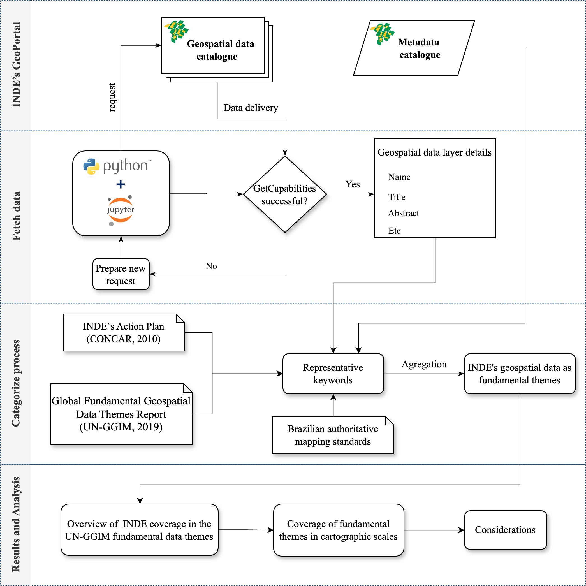

# The Brazilian NSDI: a strategic framework for management and dissemination of Fundamental Geospatial Data Themes of UN-GGIM

Flowchart illustrating the full process of the proposed open-source framework.

# Jupyter notebooks

These jupyter notebook file, encompasses code blocks for fetch data, preprocessing and analysis, providing a comprehensive running example.
 * ../notebooks/*Jnotebook_inde_unggim_v3.ipynb*
